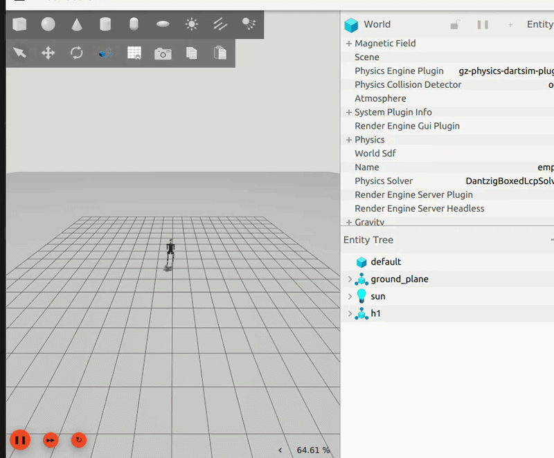
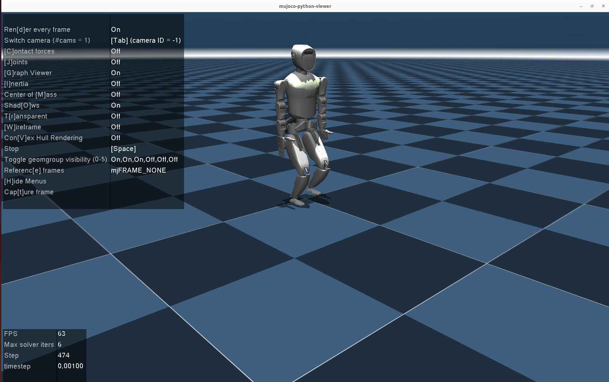
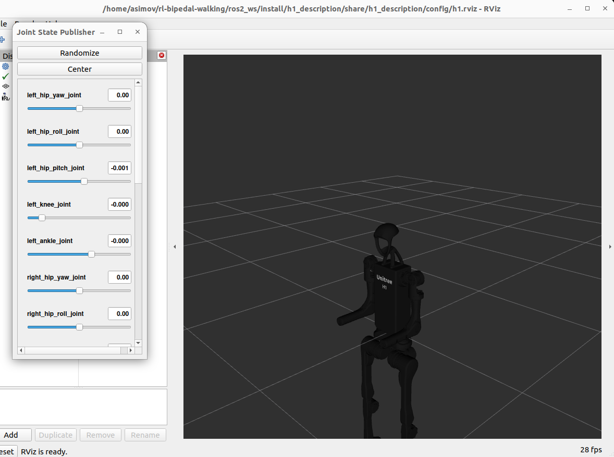

# Humanoid RL — Bipedal Locomotion with Sim-to-Real Transfer

A reinforcement learning framework for training bipedal humanoid robots to walk, combining **MuJoCo** simulation with **ROS 2 Humble** deployment pipelines. Trained policies transfer from simulation to real hardware via domain randomization and system identification.







---

## Overview

This project implements end-to-end reinforcement learning for humanoid locomotion:

- **Training** — PPO-based policy learning with parallel environments and reward shaping for stable bipedal walking
- **Sim-to-Sim Validation** — Transfer trained policies to MuJoCo for physics cross-validation before hardware deployment
- **Sim-to-Real Transfer** — Domain randomization, actuator modeling, and system identification for zero-shot transfer
- **ROS 2 Deployment** — Integration with Gazebo Sim and real robot control stacks via ROS 2 Humble

---

## Project Structure

```
rl-bipedal-walking/
├── humanoid_descriptions/           # Vendored humanoid robot sources
│   ├── ros/                         # ROS/Gazebo-oriented packages
│   ├── rl/                          # RL training stacks from official sources
│   └── urdf_only/                   # Description-focused robot packages
├── humanoid/                         # RL training package
│   ├── envs/
│   │   ├── base/                     # Base legged robot environment
│   │   └── custom/
│   │       ├── humanoid_env.py       # Humanoid env (rewards, obs, domain rand)
│   │       └── humanoid_config.py    # Training & environment hyperparameters
│   ├── scripts/
│   │   ├── train.py                  # Launch RL training
│   │   ├── play.py                   # Visualize & export trained policy
│   │   └── sim2sim.py                # MuJoCo sim-to-sim validation
│   ├── algo/                         # PPO implementation
│   └── utils/                        # Logging, terrain, task registry
├── resources/
│   └── robots/
│       └── XBot/                     # Humanoid URDF, MJCF, meshes
│           ├── urdf/                 # URDF robot description
│           └── mjcf/                 # MuJoCo XML models
├── ros2_ws/                          # ROS 2 Humble workspace
│   └── src/
│       └── bipedal_robot_description/
│           ├── urdf/                 # Robot description
│           ├── launch/               # Gazebo Sim launch files
│           └── config/               # RViz configs
├── scripts/                          # Shell helper scripts
├── logs/                             # Training run logs & exported policies
├── setup.py                          # Package install
└── requirements.txt
```

---

## Current Status

- The main RL stack in `humanoid/` is the primary training code in this repo today.
- The ROS 2 workspace in `ros2_ws/` can spawn the toy biped and local H1 wrapper in Gazebo Sim using native Gazebo Sim joint controllers bridged through ROS-GZ topics. The toy biped placeholder URDF doesn't yet match the trained XBot-L model (see "ROS 2 Integration" below).
- Official external humanoid sources are mirrored under `humanoid_descriptions/` so you can swap in stronger robot descriptions without adding nested Git repos.

---

## Quick Start

### 1. Prerequisites

- Ubuntu 22.04
- Python 3.8+
- NVIDIA GPU with CUDA 11.x+
- ROS 2 Humble
- MuJoCo 2.3.6+

### 2. Installation

```bash
git clone https://github.com/darshmenon/rl-bipedal-walking
cd rl-bipedal-walking

# Create virtual environment
conda create -n humanoid-rl python=3.8
conda activate humanoid-rl

# Install PyTorch with CUDA
conda install pytorch==1.13.1 torchvision==0.14.1 torchaudio==0.13.1 pytorch-cuda=11.7 -c pytorch -c nvidia

# Install the package
pip install -e .
pip install -r requirements.txt
```

### 3. Train a Locomotion Policy

```bash
python humanoid/scripts/train.py --task humanoid_ppo --run_name v1 --headless --num_envs 4096
```

Checkpoints save to `logs/`. `train.py` needs Isaac Gym (discontinued, may not
install on newer setups) — `train_mujoco.py` is an Isaac-Gym-free alternative,
same XBot-L model, MuJoCo + stable-baselines3 PPO:

```bash
python humanoid/scripts/train_mujoco.py --run_name v1 --num_envs 16 --total_timesteps 2000000
```

### 4. Visualize & Export the Policy

```bash
python humanoid/scripts/play.py --task humanoid_ppo --run_name v1
```

Exports a JIT-compiled policy to `logs/<experiment>/exported/policies/`.

### 5. Sim-to-Sim: Transfer to MuJoCo

```bash
python humanoid/scripts/sim2sim.py --load_model logs/XBot_ppo/exported/policies/policy_1.pt
python humanoid/scripts/sim2sim.py --load_model logs/XBot_ppo/exported/policies/policy_1.pt --terrain  # with terrain
```

Validates the policy under MuJoCo physics before hardware deployment.

### 6. ROS 2 + Gazebo Sim

```bash
cd ros2_ws
source /opt/ros/humble/setup.bash
colcon build --symlink-install
source install/setup.bash

ros2 launch bipedal_robot_description spawn_robot.launch.py
```

See "Testing Humanoids In Gazebo" below for the full set of launch files
(toy biped, H1, SLAM) and current status.

---

## RL Algorithm

### PPO (Proximal Policy Optimization)

The primary training algorithm uses an actor-critic architecture with the following specs:

| Parameter | Value |
|---|---|
| Policy Network | 3-layer MLP [512, 256, 128], ELU |
| Observation Space | 47D × 15 frames = 705D |
| Action Space | 12D continuous joint position targets |
| Learning Rate | 1e-5 |
| Discount (γ) | 0.994 |
| GAE (λ) | 0.9 |
| Clip Ratio | 0.2 |
| Entropy Coef | 0.001 |
| Parallel Envs | 4096 |
| Max Iterations | 3000 |

### Reward Function

The reward is a weighted sum of locomotion objectives:

- **Velocity tracking** — Forward/lateral/angular velocity command following
- **Gait phase** — Foot contact timing aligned to reference sinusoidal gait
- **Joint position tracking** — Penalize deviation from reference motion
- **Stability** — Base orientation, height, and acceleration penalties
- **Feet clearance** — Swing leg lift during gait cycle
- **Energy efficiency** — Torque, joint velocity, and action smoothness penalties
- **Collision** — Penalize undesired body contacts

### Domain Randomization

Applied during training for robust sim-to-real transfer:

- Friction: [0.1, 2.0]
- Base mass: [-5.0, +5.0] kg
- Random pushes every 4s (linear + angular)
- Action delay and noise injection

---

## Robot Model

**Default:** XBot-L — a 1.65m humanoid with 12 DOF legs.

| Joint Group | DOF | PD Gains (Kp/Kd) |
|---|---|---|
| Hip Roll | 2 | 200 / 10 |
| Hip Yaw | 2 | 200 / 10 |
| Hip Pitch | 2 | 350 / 10 |
| Knee | 2 | 350 / 10 |
| Ankle Pitch | 2 | 15 / 10 |
| Ankle Roll | 2 | 15 / 10 |

Robot assets live in `resources/robots/XBot/` with both URDF and MJCF descriptions.

---

## Sim-to-Sim Pipeline

The `sim2sim.py` script enables zero-shot policy transfer between simulators:

1. Train in parallel simulation → export JIT policy
2. Load policy in MuJoCo with matched robot model
3. Run PD control loop at 1000 Hz (policy at 100 Hz via decimation)
4. Verify walking behavior, contact forces, and stability

This catches policy brittleness and physics mismatches before real hardware deployment.

---

## ROS 2 Integration

`ros2_ws` provides deployment infrastructure on ROS 2 Humble: URDF/SDF
descriptions, Gazebo Sim launch files with ROS-GZ bridges, `robot_state_publisher`,
RViz configs, and scaffolding for a policy-inference node. Both the toy biped
and H1 URDFs use native Gazebo Sim `JointPositionController` plugins (one
`cmd_pos` topic per joint), not `gz_ros2_control`.

`spawn_robot.launch.py` starts Gazebo, spawns the toy biped, and bridges
`/joint_states` + one `cmd_pos` topic per leg joint. `gazebo_launch.py` does
the same plus starts `robot_controller.py`, an open-loop walking-pattern
generator driven by `/cmd_vel`:

```bash
# Direct joint command
ros2 topic pub --once /model/bipedal_robot/joint/left_hip_joint/cmd_pos std_msgs/msg/Float64 "{data: 0.1}"

# Drive the walking generator
ros2 topic pub /cmd_vel geometry_msgs/msg/Twist "{linear: {x: 0.2}, angular: {z: 0.0}}"
```

**Limitation:** the toy biped is a 6-DOF placeholder (hip/knee/ankle per leg),
not the 12-DOF XBot-L model actually trained in `humanoid/` — swapping in a
matching URDF (see "Adding a New Robot") is what's needed before a trained
policy can drive this workspace end to end.

---

## Testing Humanoids In Gazebo

There are two different simulation paths in this repo:

- `ros2_ws/` uses **ROS 2 Humble + Gazebo Sim**
- `humanoid_descriptions/ros/unitree_ros` and `humanoid_descriptions/urdf_only/berkeley_humanoid_description` are imported from **ROS 1 + classic Gazebo** ecosystems

### 1. Test the local ROS 2 humanoid

Use these when you want to validate the repo's current ROS 2 toy-biped flow:

```bash
cd ros2_ws
source /opt/ros/humble/setup.bash
colcon build --symlink-install
source install/setup.bash

ros2 launch bipedal_robot_description spawn_robot.launch.py
```

Other toy-biped launch files:

```bash
ros2 launch bipedal_robot_description gazebo_launch.py
ros2 launch bipedal_robot_description rviz_display.launch.py
```

### 2. Test the local ROS 2 H1 wrapper

`ros2_ws/src/h1_description` wraps the Unitree H1 description with Gazebo Sim
launch files, a Mid-360 lidar sensor, and an experimental standing controller.

```bash
cd ros2_ws
source /opt/ros/humble/setup.bash
colcon build --packages-select h1_description --symlink-install
source install/setup.bash

ros2 launch h1_description display.launch.py        # RViz-only
ros2 launch h1_description h1_gazebo.launch.py       # Gazebo + lidar + stand controller
ros2 launch h1_description h1_gazebo.launch.py headless:=true
ros2 launch h1_description h1_gazebo.launch.py controller:=walk   # pretrained RL walk
ros2 launch h1_description h1_slam3d.launch.py       # + RTAB-Map 3D lidar SLAM
```

This machine often runs ROS 2 graphs from other projects at the same time
(default domain 0); set a distinct `ROS_DOMAIN_ID` (e.g. `export
ROS_DOMAIN_ID=42`) before sourcing `install/setup.bash` to avoid DDS
crosstalk.

**Status:** command bridge, `/joint_states` TF, wall-time stabilizer publishing,
and odometry feedback are confirmed working. The default `stand` controller
topples within a few seconds despite high sim-only sagittal PD gains and
saturated closed-loop tilt feedback, settling into a resting pose rather than
standing. **`controller:=walk` (the pretrained `unitree_rl_gym` H1 policy)
works** — confirmed walking forward under Gazebo Sim (~12.7m in 29s, no
falls) independent of the standing problem. **SLAM works regardless** —
confirmed building a real occupancy grid on `/map` from the Mid-360 lidar and
ground-truth odometry, though `h1_slam3d.launch.py` still forces the `stand`
controller rather than `walk`.

### 3. Test imported Unitree humanoids

ROS 1 packages under `humanoid_descriptions/ros/unitree_ros/robots/` (g1, h1,
h1_2, h2, r1, r1_air descriptions), aimed at ROS 1 + classic Gazebo — **not**
this repo's ROS 2 Gazebo Sim workspace. Use the local H1 wrapper above for
ROS 2 testing; use these only inside a ROS 1 catkin workspace:

```bash
cd humanoid_descriptions/ros/unitree_ros
roslaunch h1_description gazebo.launch   # classic Gazebo
roslaunch h1_description display.launch  # RViz only
```

### 4. Test Berkeley, Booster, RobotEra models

- `humanoid_descriptions/urdf_only/berkeley_humanoid_description` — has ROS 1 launch files: `roslaunch berkeley_humanoid_description empty_world.launch` (Gazebo) or `standalone.launch` (RViz)
- `humanoid_descriptions/urdf_only/booster_assets` (`robots/T1/T1_23dof.urdf`, `robots/K1/K1_22dof.urdf`) and `humanoid_descriptions/urdf_only/robotera_models/star1` — description-only, no spawn wrapper yet. To use: copy the URDF/meshes into a ROS package, point `robot_state_publisher` at it, spawn with `ros_gz_sim create` (ROS 2) or `gazebo_ros spawn_model` (ROS 1)

---

## Adding a New Robot

1. Add URDF and MJCF assets to `resources/robots/<your_robot>/`
2. Create a config in `humanoid/envs/custom/` inheriting from `LeggedRobotCfg`
3. Set asset path, body names, default joint angles, and PD gains
4. Register the task in `humanoid/envs/__init__.py`
5. Update `sim2sim.py` joint mapping if needed

If you want to start from an existing robot instead of creating one from scratch, check `humanoid_descriptions/` first. The vendored sources include official Unitree stacks plus Berkeley, Booster, and RobotEra description packages.

---

## Training Tips

- **Headless mode**: Use `--headless` for faster training without rendering
- **GPU selection**: `--sim_device=cuda:0 --rl_device=0`
- **Resume training**: Set `resume=True` and `load_run` in config
- **Terrain curriculum**: Enable `mesh_type='trimesh'` in config for rough terrain training
- **Monitoring**: Training logs are compatible with TensorBoard and Weights & Biases

---

## Key Hyperparameters

Located in `humanoid/envs/custom/humanoid_config.py`:

```python
# Training
num_envs = 4096
max_iterations = 3000
episode_length_s = 24

# Domain Randomization
randomize_friction = True       # [0.1, 2.0]
randomize_base_mass = True      # [-5, +5] kg
push_robots = True              # random impulses
action_delay = 0.5              # simulate actuator lag
action_noise = 0.02             # observation noise

# Control
action_scale = 0.25
decimation = 10                 # 1000Hz sim → 100Hz policy
```

---

## Troubleshooting

| Issue | Solution |
|---|---|
| `libpython3.8.so` not found | `export LD_LIBRARY_PATH="~/conda/envs/humanoid-rl/lib:$LD_LIBRARY_PATH"` |
| `AttributeError: module 'distutils'` | Install PyTorch 1.12+ with matching CUDA |
| `libstdc++` version mismatch | Move conda's libstdc++ to `lib/_unused/` |
| Robot falls immediately in MuJoCo | Normal — needs trained policy loaded |
| ROS 2 topic issues | Check `ros2 topic list`, verify GZ bridge is running |

---

## References

- [Humanoid-Gym: Zero-Shot Sim2Real Transfer](https://arxiv.org/abs/2404.05695) — RobotEra / Tsinghua
- [Advancing Humanoid Locomotion with Denoising World Model Learning](https://enriquecoronadozu.github.io/rssproceedings2024/rss20/p058.pdf) — RSS 2024
- [legged_gym](https://github.com/leggedrobotics/legged_gym) — ETH Zurich RSL
- [MuJoCo Menagerie](https://github.com/google-deepmind/mujoco_menagerie) — DeepMind

---

## License

BSD-3-Clause License
